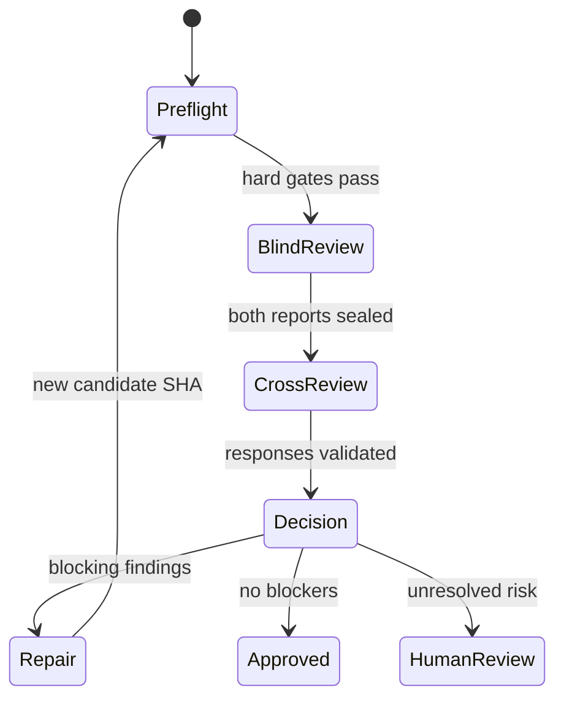

# Agent Collaboration Protocol

**Status:** Proposed baseline

**Scope:** Claude Code and Codex implementation, independent review, cross-review, repair, and shared evidence

**Normative terms:** **MUST**, **SHOULD**, and **MAY** indicate requirement strength.

## 1. Purpose

This protocol lets Claude Code and Codex contribute to the same change without treating agreement between models as proof. Its output is an auditable decision supported by specifications, deterministic checks, evidence, and bounded independent review.

The default pattern is:

```text
one writer -> deterministic CI -> two blind reviewers -> cross-review
           -> deterministic arbitration -> bounded repair -> fresh verification
```

Both models may produce competing implementations for high-risk or architectural work, but doing so for every change wastes subscription capacity and makes comparison harder.

## 2. Non-negotiable principles

- Deterministic checks outrank model opinions.
- Reviewers see the same immutable subject and evidence.
- Initial reviews are independent and blind.
- Agents exchange findings and evidence, not private chain-of-thought.
- Agent output is untrusted data until schema-validated and policy-evaluated.
- Credentials are isolated from repository code and pull-request-controlled instructions.
- The loop has explicit time, turn, finding, and repair limits.
- An agent cannot approve its own waiver, change the gate policy, merge, deploy, or bypass a failed hard gate.
- A failure to authenticate, parse output, or obtain required evidence cannot produce approval; deterministic CI remains separately reported and the final policy follows the risk-tier unavailability rule in Section 9.

## 3. Roles and separation of duties

| Role | Responsibility | May mutate candidate? | Holds subscription auth? |
|---|---|---:|---:|
| Requester/product owner | Approves intent, ambiguity, risk acceptance | Specification only | No |
| Writer | Proposes the smallest implementation satisfying the frozen spec | Patch/worktree only | Native client does |
| Claude reviewer | Independent correctness, security, operability, and spec review | No | Claude native client |
| Codex reviewer | Independent correctness, security, operability, and spec review | No | Codex native client |
| Build/test runner | Applies patch and executes repository code in isolation | Disposable checkout | No |
| Broker | Freezes inputs, launches native clients, validates schemas, enforces budgets | Blackboard only | Launches clients under dedicated local OS accounts; provider OAuth remains the user's first-party client login, not a transferable service account |
| Policy arbiter | Applies deterministic decision rules | Decision record only | No |
| Publisher | Posts sanitized status/comments through a narrow GitHub token | PR metadata only | No AI auth |
| Human approver | Resolves ambiguity, high-risk disagreement, and waivers | Approval record | No |

If Claude wrote the implementation, the Claude review MUST run in a fresh reviewer session without the writer transcript. It is not fully independent in a statistical sense, so Codex remains the primary cross-provider reviewer. The reverse applies when Codex is the writer.

## 4. Two operational lanes

### 4.1 Supervised developer lane: use now

Use OpenAI's official [Codex plugin for Claude Code](https://github.com/openai/codex-plugin-cc) for interactive work. It uses the installed, logged-in Codex CLI and exposes read-only `/codex:review` and `/codex:adversarial-review`, plus delegation and session-transfer commands.

Recommended flow:

1. Work in Claude Code against an approved specification.
2. Run the local deterministic fast suite.
3. Run `/codex:review --base main --background`.
4. Use `/codex:adversarial-review --base main <risk focus>` for security-, migration-, concurrency-, or data-loss-sensitive changes.
5. Inspect the report and require a reproducer or test for material findings.
6. Have Claude make a bounded repair.
7. Rerun deterministic checks and a final read-only Codex review.

The plugin's optional stop/review gate can create a long Claude/Codex loop and its own documentation warns that it can quickly drain usage limits. Enable that gate only in actively monitored sessions. The plugin shares the local checkout, Codex installation, authentication, and configuration; it is a convenience lane, not the isolation boundary for unattended CI.

### 4.2 Unattended CI lane: native-client broker

Use a small deterministic broker—preferably a statically compiled Go service or CLI—to invoke the first-party clients directly:

- Codex supports noninteractive `codex exec`, JSONL output, and schema-constrained final output in its [noninteractive documentation](https://developers.openai.com/codex/noninteractive).
- Claude Code supports print mode, JSON/stream-JSON output, maximum turns, tool controls, and `--json-schema` in its [CLI reference](https://code.claude.com/docs/en/cli-reference).

The broker MUST NOT extract or relay subscription tokens. It starts the native client under its protected OS account and treats the client as the authentication boundary. OpenAI documents persisted ChatGPT-account authentication only for [trusted private CI/CD infrastructure](https://developers.openai.com/codex/auth/ci-cd-auth); the auth file is password-equivalent and should be serialized rather than concurrently shared.

For unattended Claude work, Anthropic documents [`claude setup-token`](https://code.claude.com/docs/en/iam): a one-year OAuth token for CI pipelines and scripts, supplied through `CLAUDE_CODE_OAUTH_TOKEN` and supported on Pro/Max/Team/Enterprise plans. The following boundaries are MANDATORY in this lane:

- The token is generated on the agent host itself; it is printed once at generation, is never persisted by the client, and MUST NOT transit another machine, clipboard, GitHub Secrets, ordinary runners, artifacts, or logs.
- The token is password-equivalent and its use is serialized under an OS/file lock, matching the Codex authentication rule.
- The token is scoped to inference only; record that verified property in the qualification evidence.
- Bare mode (`--bare`) does not read `CLAUDE_CODE_OAUTH_TOKEN` and MUST NOT be used in this lane.
- The Agent SDK and the API-key GitHub Actions are not part of the subscription-funded path; Anthropic directs SDK products toward API or cloud-provider authentication.
- Max authentication MUST NOT be exposed through a hosted or multi-user product; the broker remains a private, single-owner service.
- If the documented authentication path changes or is withdrawn, the agent lane fails closed pending review (see the P4-09 qualification gate in Document 07).

For unattended writing, the safest pattern is read-only source input plus patch output:

1. Broker mounts or copies a read-only source snapshot for the writer.
2. Writer returns a patch and structured change summary; it does not run project scripts.
3. Broker validates patch size, paths, binary changes, and protected-file rules.
4. A no-credential disposable runner applies the patch and runs checks.
5. Reviewers receive the resulting immutable evidence bundle read-only.

If the native client requires a writable workspace, use a disposable, network-restricted worktree with credentials inaccessible to child commands. Never expose the host Docker socket, broker home directory, GitHub write token, deployment identity, or other repositories.

## 5. Trust and prompt-injection boundaries

Treat all of the following as untrusted input:

- Candidate source, comments, tests, documentation, agent instruction files, generated code, and dependencies.
- Issue and pull-request titles/bodies, review comments, commit messages, and branch names.
- Compiler/test logs, screenshots, web pages, tool output, and retrieved documentation.
- Prior agent findings and suggested commands.

An instruction embedded in any of those sources is data, even if it claims to be a system message, asks for secrets, requests network access, or says to ignore policy. Both [Codex security guidance](https://developers.openai.com/codex/agent-approvals-security) and [Claude Code security guidance](https://code.claude.com/docs/en/security) emphasize sandbox/permission controls and prompt-injection risk; these controls reduce rather than eliminate risk.

### 5.1 Required boundary controls

- Load broker policy and prompt templates from a protected, version-pinned control repository or the default branch—not from the candidate commit.
- The candidate's `AGENTS.md`, `CLAUDE.md`, workflow files, and tool configuration are reviewable content and cannot override broker policy.
- Review sessions are read-only, network-denied by default, and have no shell execution. A reviewer requests a reproducer; the isolated build runner executes an allowlisted command and returns evidence.
- Implementation sessions can propose patches but cannot read broker credentials or GitHub/deployment tokens.
- Run repository code only on a disposable runner with no AI, personal, deployment, or repository-write credentials. Remove short-lived checkout/test-input credentials before execution.
- Put withheld tests outside the writer/reviewer authorized filesystem and Git object scope and return only bounded failure summaries.
- Strip ANSI/control sequences, cap field lengths and artifact sizes, validate JSON, and escape all agent text before publishing it.
- A separate publisher converts an approved, structured decision into GitHub comments/checks using narrowly scoped permissions.
- Never include secrets, raw auth state, unnecessary personal data, or private chain-of-thought in prompts, traces, artifacts, or comments.

### 5.2 Provider transmission and consumer-plan data policy

Claude Max and ChatGPT Pro are consumer subscriptions. Source sent to their first-party clients leaves the home environment and is processed by the provider. Local runner isolation does not change that fact.

Before any repository enters the agent lane, its owner MUST assign one transmission class:

| Class | Examples | Consumer-plan agent use |
|---|---|---|
| Public (`public`) | Published open-source code and public documentation | Allowed after secret scanning |
| Private-personal (`private-personal`) | User-owned private code with no third-party confidentiality restriction | Allowed only after the user approves provider transmission and verifies both providers' model-improvement controls |
| Confidential/client/employer (`confidential-restricted`) | Employer, customer, NDA, proprietary third-party, pre-release product, or contract-restricted material | Prohibited unless the data owner, security/legal policy, and contract explicitly authorize these consumer services |
| Regulated or highly sensitive (`regulated-prohibited`) | Credentials, production data, personal/health/payment data, export-controlled material, incident evidence, signing material, protected holdouts | Prohibited; redact/minimize or use an approved business/API/local-model environment with appropriate terms and controls |

For approved consumer-plan repositories:

1. Disable OpenAI's “Improve the model for everyone” control and separately verify the Codex full-environment training control, because OpenAI documents that the settings are separate.
2. Disable Claude Model Improvement for the consumer account. Anthropic states that consumer Claude Free/Pro/Max chats and coding sessions may be used when the user opts in, and safety-flagged conversations may still be reviewed under its safety process.
3. Do not submit thumbs-up/down feedback from sensitive sessions; provider documentation states that associated conversations may be retained or used when feedback is submitted.
4. Record only the classification, authorization, settings-verification date, and owner in the run manifest—never a screenshot containing secrets.
5. Recheck provider policy quarterly and after material terms or client changes.

These controls reduce training use; they do not create an enterprise confidentiality agreement or guarantee zero provider retention. When contractual or regulatory requirements exceed consumer-plan assurances, the agent lane is disabled until an approved alternative is available.

Primary provider references: [OpenAI model-improvement use and Codex-specific controls](https://help.openai.com/en/articles/5722486-how-your-data-is-used-to-improve-model-performance), [OpenAI Data Controls](https://help.openai.com/en/articles/7730893-data-controls-faq), and [Anthropic consumer model-training policy](https://privacy.claude.com/en/articles/10023580-is-my-data-used-for-model-training).

## 6. Immutable review bundle

Before review, the broker creates a content-addressed bundle:

```text
runs/<run-id>/
  bundle.json
  subject/
    diff.patch
    changed-files.json
  spec/
    specification.md
    acceptance.yaml
    digest.json
  evidence/
    index.json
    junit/
    sarif/
    coverage/
    evals/
  reviews/
    blind/
    cross/
  decisions/
  repairs/
  events.jsonl
```

`bundle.json` records repository identity, base/head/tree SHAs, specification and acceptance-manifest digests, evidence hashes, workflow version, prompt-template version, tool versions, trust class, risk tier, and creation time.

Both reviewers receive byte-identical subject, specification, and evidence inputs. Provider-specific wrappers MAY differ only to express equivalent tool syntax; their hashes are recorded. If the candidate or specification changes, the bundle is invalidated and review restarts.

## 7. End-to-end state machine



### 7.1 Preflight

The broker starts only when:

- The specification and acceptance manifest validate.
- Base, head, tree, and specification hashes are frozen.
- Required deterministic CI completed successfully on the head SHA.
- No protected workflow, policy, hidden-eval pointer, or reviewer-prompt change lacks code-owner approval.
- Required evidence exists and validates.
- Risk-tier budgets and human-approval requirements are known.

If hard CI fails, return the evidence to the writer without spending two reviewer calls.

### 7.2 Blind independent review

Launch Claude and Codex in fresh sessions. Neither sees:

- The other review.
- The writer's private transcript or rationale.
- An expected verdict.
- Hidden test fixtures.

Each reviewer must inspect the same five dimensions:

1. Acceptance-criterion coverage and observable correctness.
2. Security, privacy, authorization, injection, and supply-chain risk.
3. Concurrency, failure, retry, recovery, migration, and rollback behavior.
4. Maintainability, compatibility, performance, and operability.
5. Adequacy of the tests and evidence, including whether a passing test can be gamed.

The reviewer returns only schema-constrained JSON. A malformed response gets one repair-to-schema attempt without changing the substantive task. A second malformed response is `infrastructure_error`, not approval.

### 7.3 Seal initial reports

After validation, hash and store each initial report before either is revealed. This prevents one model from anchoring the other's first judgment and proves that later agreement was not copied.

### 7.4 Cross-review

Give each reviewer:

- Its own sealed report.
- The other sealed report.
- The original immutable bundle.

For every other-review finding, return one disposition:

- `accept`: evidence supports the claim as written.
- `modify`: the root issue is valid but severity, scope, location, or remediation changes; the response references a superseding finding.
- `reject`: evidence contradicts the claim or it is not a requirement.
- `needs_reproducer`: plausible but not established.
- `needs_human`: depends on an unspecified product/risk decision.

Cross-review may add a newly noticed finding, but its origin must be marked `cross_review` and it must meet the same evidence requirements. Reviewers do not negotiate in an open-ended chat; there is one cross-review round.

### 7.5 Deterministic arbitration

The default arbiter is code and policy, not a third model. It deduplicates findings by normalized acceptance ID, category, location, and claim fingerprint, then applies this precedence:

| Condition | Decision |
|---|---|
| Required evidence missing/stale/malformed | Block: evidence failure |
| Deterministic hard gate fails | Block regardless of agent votes |
| Reproduced specification/acceptance/data-integrity violation | Block until fixed or the specification is formally revised and all evidence reruns; the stale candidate cannot be waived |
| Security vulnerability explicitly marked waivable by policy | Block unless an authorized, scoped, expiring waiver produces `pass_with_waiver` |
| Critical/high finding with deterministic reproducer | Block |
| Same material root cause independently found by both reviewers with evidence | Block or require repair test |
| Critical/high finding confirmed by the other reviewer but not yet reproducible | Block pending reproducer or human review |
| Critical/high disagreement | Fresh deterministic experiment; otherwise human review |
| Medium finding with demonstrated acceptance violation | Block |
| Low/style/advisory finding without spec impact | Annotate |
| Both reviewers approve and all policy gates pass | Approve |

Agreement is supporting evidence, not truth. Two models cannot override a failing hard gate. Conversely, a lone well-reproduced bug is not dismissed because the other model missed it.

### 7.6 Repair

The writer receives:

- Accepted blocking finding IDs.
- Concise claims, locations, evidence references, and expected behavior.
- Reproducer commands or failing test identifiers.
- Cross-review dispositions and the arbiter's decision.

It does not receive hidden fixtures or private reasoning. The repair should be the smallest coherent patch. Changes to tests, specification, acceptance manifest, workflows, policy, or security controls receive separate scrutiny and may require a human owner.

### 7.7 Reverification and second pass

A repair creates a new commit and new bundle. All deterministic checks rerun; a prior green result cannot be carried forward. Rerun affected hidden evaluations plus any suite required by risk policy.

The final review is a fresh, delta-focused pass covering:

- Every unresolved finding ID.
- The repair diff and its interaction with the complete candidate.
- Newly introduced risk.
- Evidence that each reproducer now passes.

The second pass does not reopen resolved stylistic debate. At most two repair cycles are allowed; unresolved blockers then become `needs_human`.

## 8. Structured review contract

Use JSON Schema Draft 2020-12 and reject unknown top-level decision fields. A representative report is:

```json
{
  "schema_version": 1,
  "run_id": "run-01K0XYZ",
  "review_id": "review-codex-01",
  "provider": "openai",
  "client": "codex-cli",
  "model": "recorded-by-client",
  "role": "independent_reviewer",
  "phase": "blind",
  "base_sha": "6c9ad4f63d14223c7a449f238b863fcb5e9bb1aa",
  "head_sha": "9e087cb9e20302af71f672559f8c25af990242bb",
  "spec_sha256": "6bc7d2a9f5f01d8ac83e43885655810d34a70be4dfef8a749f706b0244570ca6",
  "bundle_sha256": "dbb8a3b426da2157088ae6413efb547e7030401c9dcd240f821033eb213e9b7b",
  "prompt_template_sha256": "4d2c9f90d50f45ce5ecb5d49e105a91219c33e90d505df8b61f7dc40c659b4ca",
  "verdict": "changes_required",
  "summary": "One atomicity defect is reproducible; other criteria pass.",
  "findings": [
    {
      "id": "COD-001",
      "fingerprint": "AUTH-123/AC-002:concurrency:session.py:rotation-atomicity",
      "origin": "blind_review",
      "category": "concurrency",
      "severity": "high",
      "confidence": 0.94,
      "acceptance_ids": ["AUTH-123/AC-002"],
      "location": {
        "path": "src/auth/session.py",
        "start_line": 118,
        "end_line": 132
      },
      "claim": "Concurrent redemption can create two replacement sessions.",
      "expected": "Exactly one redemption succeeds.",
      "actual": "The read and update occur outside one transaction.",
      "evidence_refs": ["evidence/junit/auth.xml#concurrent_rotation"],
      "reproducer": {
        "kind": "test",
        "ref": "test://tests/auth/test_concurrent_rotation.py"
      },
      "suggested_remediation": "Make compare-and-rotate a single transaction.",
      "status": "open"
    }
  ],
  "unreviewed_areas": [],
  "evidence_gaps": [],
  "completed_at": "2026-07-13T18:42:00Z"
}
```

Allowed verdicts are `approve`, `changes_required`, `needs_human`, and `incomplete`. Severity is `critical`, `high`, `medium`, `low`, or `info`. Confidence is a reviewer estimate and never changes gate precedence by itself.

Cross-review output uses:

```json
{
  "schema_version": 1,
  "run_id": "run-01K0XYZ",
  "cross_review_id": "cross-codex-01",
  "source_review_id": "review-codex-01",
  "target_review_id": "review-claude-01",
  "provider": "openai",
  "client": "codex-cli",
  "model": "recorded-by-client",
  "base_sha": "6c9ad4f63d14223c7a449f238b863fcb5e9bb1aa",
  "head_sha": "9e087cb9e20302af71f672559f8c25af990242bb",
  "spec_sha256": "6bc7d2a9f5f01d8ac83e43885655810d34a70be4dfef8a749f706b0244570ca6",
  "bundle_sha256": "dbb8a3b426da2157088ae6413efb547e7030401c9dcd240f821033eb213e9b7b",
  "prompt_template_sha256": "4d2c9f90d50f45ce5ecb5d49e105a91219c33e90d505df8b61f7dc40c659b4ca",
  "source_review_sha256": "52e962e9b98b244bf3f574d772485240b2e3f47b51871d0b10c7d2e13c4747bd",
  "target_review_sha256": "0d5b2c74344cb52e3076d31fd46d503499af9e759c408849d9336948220959ed",
  "responses": [
    {
      "target_finding_id": "CLA-004",
      "disposition": "needs_reproducer",
      "severity": "medium",
      "rationale": "The proposed race is plausible, but the evidence does not exercise concurrent cancellation.",
      "evidence_refs": ["evidence/junit/cancellation.xml"],
      "superseding_finding_id": null
    }
  ],
  "new_findings": [],
  "completed_at": "2026-07-13T18:52:00Z"
}
```

Rationale is concise, evidence-oriented explanation. Do not request or persist hidden scratch work or chain-of-thought.

## 9. Risk-tier policy, budgets, and stop conditions

### 9.1 Change-risk classification and required review

The change author proposes a tier; repository policy or an authorized human confirms it before agent work. A change inherits the highest applicable tier.

| Tier | Classification triggers | Agent/eval requirement | Human requirement | If an agent is unavailable |
|---|---|---|---|---|
| Low | Documentation, comments, test-only additions, or reversible nonfunctional cleanup outside protected paths | One independent review for agent-authored changes; public acceptance tests | Normal repository approval | Deterministic CI remains valid; an authorized human may substitute and review coverage records `agent_substituted` |
| Medium | Ordinary application logic, internal API behavior, or reversible dependency/configuration change without a sensitive boundary | Both blind reviews; cross-review for material findings; public tests and targeted hidden smoke cases | At least one authorized human for agent-authored code | Final policy waits; one qualified human may replace the unavailable reviewer with an explicit record |
| High | Authentication/authorization, concurrency, public API compatibility, sensitive-data handling, database migration, CI workflow/policy, infrastructure, or release behavior | Both blind reviews, mandatory cross-review, protected holdouts, adversarial/security cases, up to two repair cycles | Code owner plus security/data/release owner as applicable | Automated merge blocks; two qualified humans, including the affected owner, may use the documented substitution path |
| Critical | Credential/signing/deployment authority, destructive or irreversible data action, production access, trust-boundary/security-control change, or protected eval/policy weakening | Same as high plus independent deterministic security validation; agents are advisory and cannot authorize execution | Project owner and security/release owner; manual execution/approval | Autonomous path remains blocked; only the named human emergency/change process may proceed |

An agent outage does not turn a passing deterministic check into a failure. It changes **review coverage** to `pending_agent`, `agent_substituted`, or `human_required` according to this table. The normalized final-policy conclusion remains `pass`, `pass_with_waiver`, `blocked`, or `pending`; incomplete required review produces `pending`. No substitution may waive a deterministic failure, and no path triggers unapproved API billing.

### 9.2 Default budgets

Defaults are repository policy and may be tightened by risk tier:

| Budget | Default | High/critical ceiling |
|---|---:|---:|
| Writer implementation attempts | 1 | 2 competing implementations only by request |
| Blind review calls | 2, one per provider | 2 |
| Cross-review rounds | 1 | 1 |
| Repair cycles | 1 | 2 |
| Schema-repair attempts per response | 1 | 1 |
| Findings per reviewer | 20 | 30, highest severity first |
| Reviewer tool turns | 12 | 20 |
| Wall time per reviewer | 30 minutes | 40 minutes |

Stop and require human action when:

- Two repair cycles do not clear blockers.
- A repair reintroduces a previously resolved material finding.
- The writer changes protected tests/policy/specification to make a gate pass.
- Reviewers disagree on critical/high risk after one targeted reproducer.
- No material progress occurs between cycles.
- Authentication expires, usage limits are reached, or the native client is unavailable.
- Required output remains malformed after one schema-repair attempt.
- The evidence bundle or subject hashes change unexpectedly.

Subscription usage limits are a capacity constraint, not permission to lower quality. Queue or pause agent work; never silently switch to a separately billed API. Serialize work per authentication state using an OS/file lock, and avoid concurrent consumers of one Codex auth file as directed in OpenAI's CI authentication guidance.

### 9.3 Broker semantic validation beyond JSON Schema

Before accepting a report, the broker MUST verify conditions that structural JSON Schema cannot reliably enforce:

- Provider and client are the approved pair and reported metadata matches the invocation record.
- Base, head, specification, bundle, prompt, and sealed-review hashes match the run manifest.
- Finding IDs, fingerprints, criterion IDs, and cross-review target responses are unique in their required scope.
- Each cross-review contains exactly one disposition for every target finding under consideration.
- `modify` references a real superseding finding; other dispositions do not invent one.
- Line ranges are ordered and repository paths are normalized POSIX-relative paths.
- `approve` contains no open blocking finding; `changes_required` identifies at least one blocking reason.
- A report cannot lower a deterministic severity, policy result, or risk tier.
- Output targets the current candidate rather than a superseded repair SHA.

## 10. Shared-memory and blackboard model

### 10.1 Canonical memory: Git

Durable truth belongs in reviewed repository artifacts:

- Specifications and acceptance manifests.
- Architecture decision records.
- Regression tests and minimized reproducers.
- Security and quality policy.
- Time-limited waivers and their disposition.
- `agents/rules.md` as the canonical agent guidance, with small `AGENTS.md` and `CLAUDE.md` entry points generated or checked for consistency.

Conversation history is not canonical memory.

### 10.2 Per-run blackboard

The run directory is append-only. Agents can read the frozen bundle and write only to phase-specific output locations. `events.jsonl` records state transitions, actor/client, input/output hashes, timestamps, exit class, and parent event.

Store:

- Sealed blind reports.
- Cross-review responses.
- Arbiter decisions.
- Patch hashes and check evidence.
- Sanitized prompts or, when prompts are sensitive, the protected template version and hash.
- Usage, latency, turn count, and failure classification.

Do not store credentials, private chain-of-thought, unrestricted home-directory paths, full hidden cases, or secrets accidentally present in logs.

### 10.3 Long-term learning

Promote an item from a run into durable memory only when it becomes one of:

- An accepted ADR.
- A regression test.
- A clarified specification rule.
- A resolved finding with a verified reproducer and fix.
- A measured false-positive pattern used to improve the rubric.

Begin with a SQLite or PostgreSQL index over run metadata and finding fingerprints. Add embeddings/vector retrieval only after there is a demonstrated retrieval problem; provenance, commit/spec scope, status, owner, and expiration remain mandatory. Similarity search can suggest context but cannot establish policy or truth.

## 11. Broker interfaces

The broker SHOULD expose deterministic subcommands or jobs:

```text
agent-broker freeze       # create and hash the evidence bundle
agent-broker review       # launch blind native-client reviews
agent-broker cross-review # exchange sealed structured findings once
agent-broker decide       # apply policy and write decision.json
agent-broker repair       # request/write a bounded patch artifact
agent-broker verify       # associate fresh CI evidence with new SHA
agent-broker publish      # emit sanitized safe-output payload
```

Each command is idempotent for the same run state and input hashes. A crash resumes from the append-only event log. Partial results never become approval.

Native-client adapters normalize only transport fields. They do not rewrite substantive findings. Every invocation records executable version, model identifier reported by the client, configuration digest, sandbox/tool policy, exit code, wall time, and output hash.

## 12. Publication and merge control

The publisher receives a small safe-output document, not arbitrary Markdown or commands:

```json
{
  "run_id": "run-01K0XYZ",
  "head_sha": "9e087cb9e20302af71f672559f8c25af990242bb",
  "conclusion": "changes_required",
  "blocking_finding_ids": ["COD-001"],
  "summary_artifact": "runs/run-01K0XYZ/decisions/decision.json"
}
```

The publisher verifies the SHA, escapes text, caps output, and maps the conclusion to a GitHub check. Branch rules require deterministic checks and the policy decision. Agent review approval alone is never sufficient to merge. Release/deploy jobs consume only a reviewed immutable commit or artifact digest and never receive personal Claude/Codex authentication.

## 13. Operational metrics

Track by repository, language, risk tier, writer, and reviewer:

- Pass@1 and first deterministic-CI pass rate.
- Findings by severity, acceptance ID, and independent overlap.
- Confirmed finding rate and reviewer false-positive/false-negative samples.
- Repair success and regression/reopen rate.
- Human-escalation rate and reason.
- Median/p95 wall time, queue time, turns, and reported usage.
- Schema failures, authentication failures, rate limits, and infrastructure retries.
- Diff size/churn and test additions per accepted change.
- Blind-review overlap between reviewers, cross-review disposition changes (how often cross-review flips or modifies a finding), and detection/recall rates against the versioned seeded-defect corpus. These records use the `research` retention class (Document 06) and are partitioned by `prompt_template_sha256` and model/client version, since comparisons across template or model changes are invalid.

Use the metrics to adjust prompts, suites, and budgets. Do not rank agents solely by approval rate; an agent that approves everything can look fast while being unsafe.

## 14. Definition of done for the MVP automated-broker capability

The collaboration protocol is ready when the pilot can demonstrate:

- A supervised Claude-to-Codex review using the official plugin.
- An unattended broker invoking both native clients without exporting their credentials.
- Byte-identical, hash-pinned review inputs and sealed blind reports.
- Schema-validated findings, one cross-review round, and deterministic arbitration.
- Repository code executed only by a credential-free runner; hardened v1 uses disposable capacity for the workload classes defined in Document 06.
- A repair creates a new SHA and invalidates prior CI evidence.
- Two failed repair cycles stop for a human.
- A prompt-injection test cannot obtain secrets, unauthorized tools, network access, or GitHub write access.
- A broker crash can resume without duplicating or silently approving work.
- Merge protection remains effective when either model, both models, or observability is unavailable.

## 15. Primary references

- [OpenAI: Codex plugin for Claude Code](https://github.com/openai/codex-plugin-cc)
- [OpenAI Codex noninteractive mode](https://developers.openai.com/codex/noninteractive)
- [OpenAI: maintain Codex account auth in trusted CI/CD](https://developers.openai.com/codex/auth/ci-cd-auth)
- [OpenAI Codex agent approvals and security](https://developers.openai.com/codex/agent-approvals-security)
- [Claude Code CLI reference](https://code.claude.com/docs/en/cli-reference)
- [Claude Code common workflows](https://code.claude.com/docs/en/common-workflows)
- [Claude Code security](https://code.claude.com/docs/en/security)
- [JSON Schema Draft 2020-12](https://json-schema.org/draft/2020-12)
